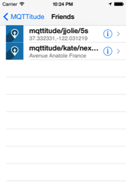
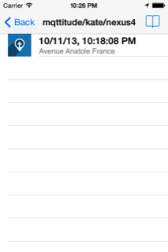
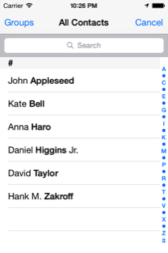
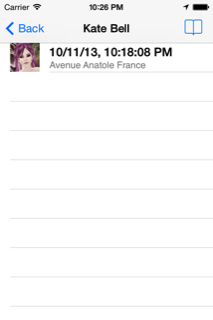
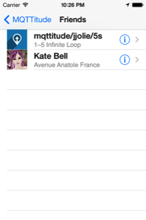
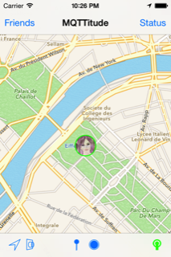
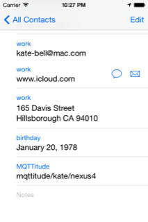

# iOS Friends

The _Friends_ feature in the iOS MQTTitude app shows publishes seen on the same broker. What this means is that you and your friends or family must share a broker. (This can be done either by configuring all apps to use the same broker or by what is called _bridging_.)

The app "sees" a friend as soon as it receives a publish to the topic branch subscribed to, which by default is `mqttitude/+/+`.

Select the _Friends_ button to see a list of friends:

Tapping on one of the friends, performs a reverse geo-coding to show address. Furthermore, a click on the little right-arrow shows the last 5 locations of that friend.

## Who is that?

It's difficult to remember which MQTT topic belongs to which friend, so we can associate a topic with an image of the friend as contained in the iOS address book:

Select an entry:

Then click on the _bookmark_ icon on top right. The Address book opens.

Select the entry you want to associate with the MQTTitude topic. In this
example, I choose Kate Bell: (note, this works only with contacts stored locally -- not with corporate address books associated with your iPhone).

We're back in MQTTitude, and we see the picture from the addressbook.

When you zoom the map out (or near to the friend's location), you see a small rendition of the icon directly on the map.

Voila!
