## Getting started with the MQTTitude iPhone app

After downloading and installing the iPhone app, resist the temptation to launch it. Instead, go to your device's _Settings_, and locate _MQTTitude_. Click on that.

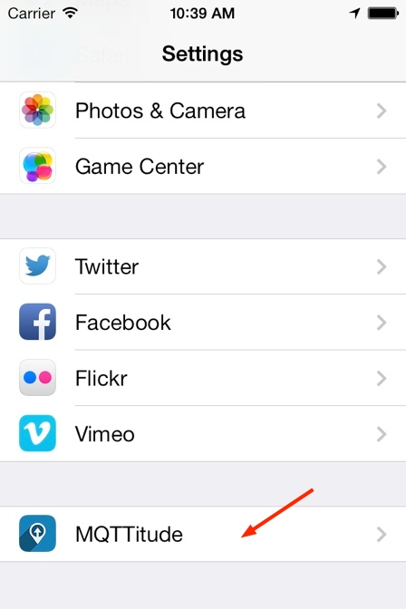

You're now in the settings panel for MQTTitude, and there are three (4) things you have to change.

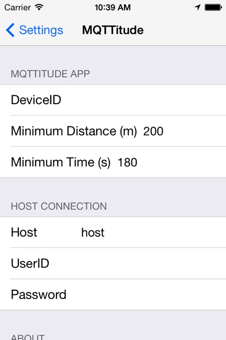

1. _DeviceID_ is a short name you'll give your device. Good examples could be `iphone`, `myphone`, or `xyzz90`.
2. _Host_ is the host name or IP address of your MQTT broker. (The port defaults to 8883 because we default to using TLS.)
3. _UserID_ is your username on the broker. Even if your broker doesn't enforce authentication, you _must set a UserID_.
4. _Password_ is the password for _UserID_.

For example, I've set the following:

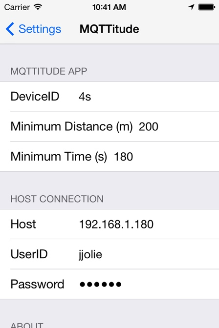

Now launch MQTTitude.

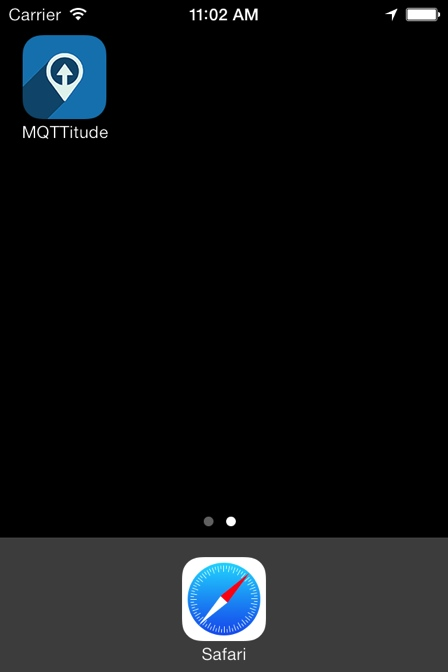

The first time you launch the app, you'll be asked to confirm that the app wants to use your location. You'll also be asked whether it should allow notifications, which you should answer with OK.

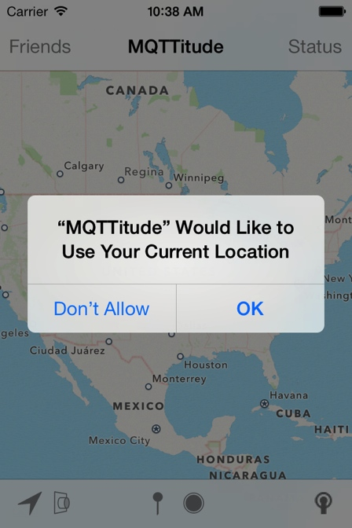


You'll then see the app's main screen, and the connection to the MQTT broker is attempted.

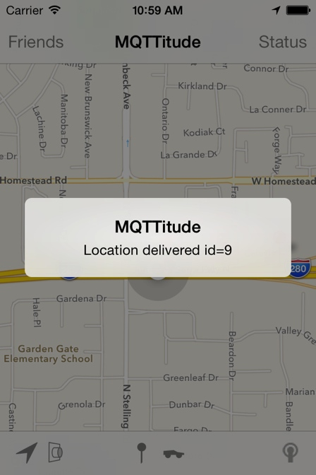

Verify the _Effective Settings_ by a click on _Status_. This shows you the URL the app is using, and importantly, the _DeviceID_ and _Topic_ it's using. By default the topic is constructed from the constant `mqttitude`, your _userid_, and  your _deviceid_.

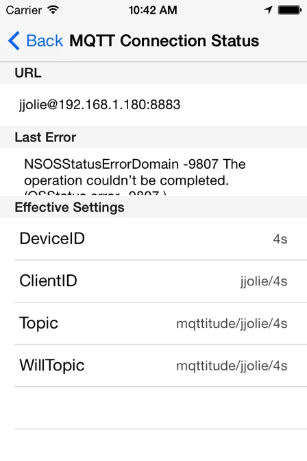

### Follow your broker

At this point in time you should check that the MQTT broker is actually receiving location messages. We recommend you subscribe to your broker to trace what's happening. First, I launch `mosquitto_sub` in the shell.

```
mosquitto_sub -h hostname -v -t '#'
```

As soon as the app delivers (PUBlishes) its location, I'll see something like this:

```
mqttitude/jjolie/4s {"tst":"1382172843","lat":"48.858330","_type":"location","lon":"2.295130","acc":"5m"}
```

### Main screen

Let's look at the main screen for a moment:

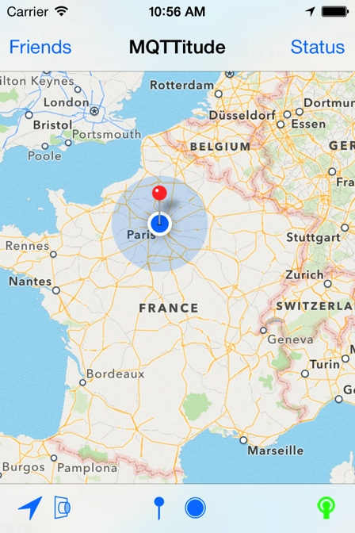

The icons on the bottom row are as follows:

1. Map Follow Mode:
  - outlined arrow - map does not follow user's location (indicated by blue spot)
  - filled arrow - map does follow the current location
  - upward pointing arrow - map does follow the current location and heading
  - friends symbol - map zooms out to show the positions of all friends
2. Type of map display.
3. The "Pin". Tapping this will deliver your current position to the MQTT broker immediately.
4. Mode: filled circle is automatic, empty cirle is manual, car is move-mode.
5. Status
  - BLUE=IDLE, no connection established
  - GREEN=CONNECTED, server connection established
  - AMBER=ERROR OCCURED, WAITING FOR RECONNECT, app will automatically try to reconnect to the server
  - RED=ERROR, no connection to the server possible or transient errror condition

More [details](https://github.com/binarybucks/mqttitude/blob/master/docs/features.md)

Tap on _Friends_ to see your position.

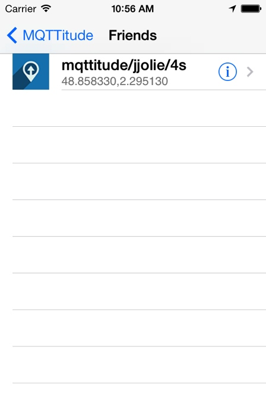

### Expert stuff

The app's settings has a number of additional _Expert_ settings:

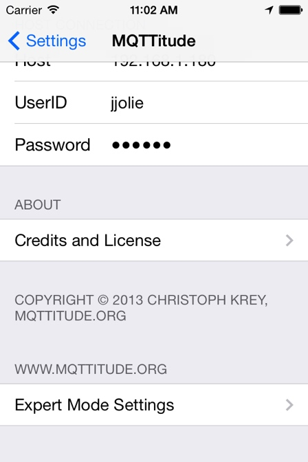


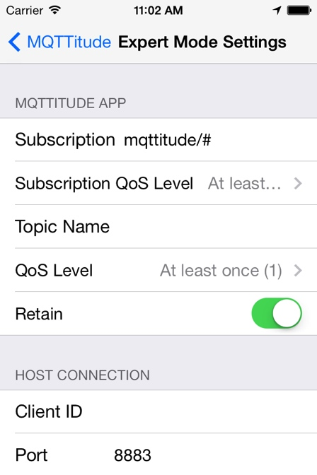

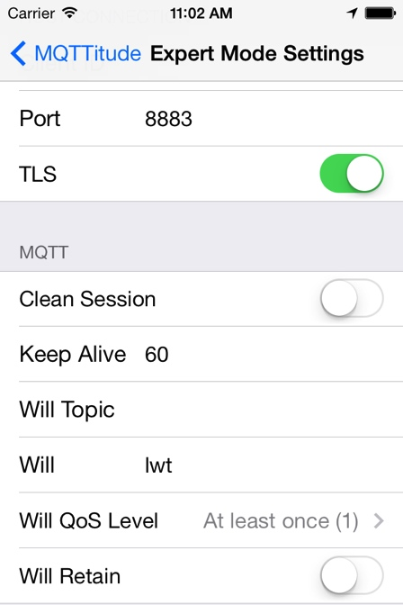
